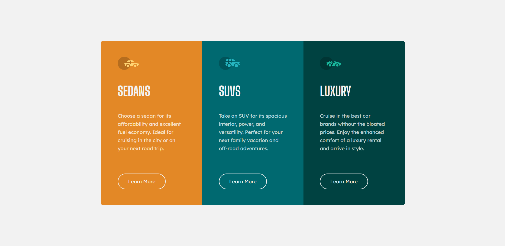

# Frontend Mentor - 3-column preview card component solution

This is a solution to the [3-column preview card component challenge on Frontend Mentor](https://www.frontendmentor.io/challenges/3column-preview-card-component-pH92eAR2-). Frontend Mentor challenges help you improve your coding skills by building realistic projects. 

## Table of contents

- [Screenshot](#screenshot)
- [My process](#my-process)
- [Built with](#built-with)
- [Useful resources](#useful-resources)
- [Author](#author)

### Screenshot

## My process

I start by create HTML and then I write the SCSS, in my SCSS I define some variables (Typo, Colors) and I style the card.

### Built with

- HTML
- SCSS
- Visual Studio Code

### Useful resources

- [ MDN ](https://developer.mozilla.org/fr/) - I always use this website for work.

## Author

- Frontend Mentor - [@Nelo0o](https://www.frontendmentor.io/profile/Nelo0o)