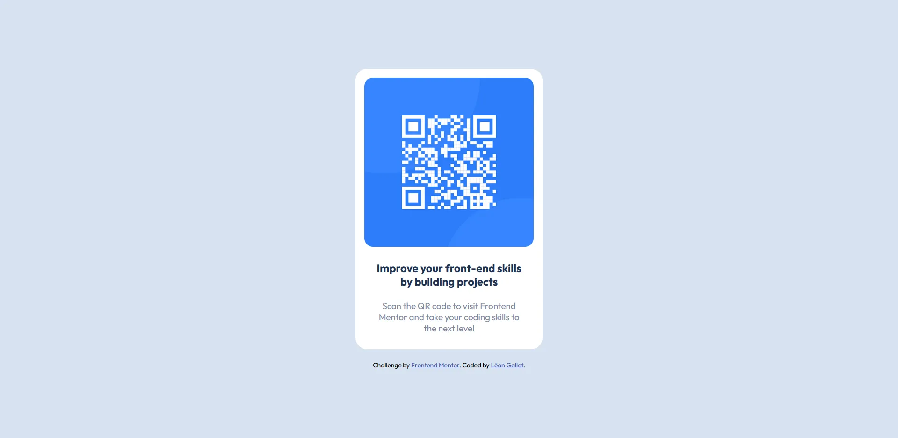

# Frontend Mentor - QR code component solution

This is a solution to the [QR code component challenge on Frontend Mentor](https://www.frontendmentor.io/challenges/qr-code-component-iux_sIO_H). Frontend Mentor challenges help you improve your coding skills by building realistic projects.

## Table of contents

- [Screenshot](#screenshot)
- [My process](#my-process)
- [Built with](#built-with)
- [Useful resources](#useful-resources)
- [Author](#author)

### Screenshot

## My process

I started by building the HTML of the card, then I linked my CSS file in which I created my variables as well to finally style the card.

### Built with

- HTML
- CSS
- Visual Studio Code

### Useful resources

- [ MDN ](https://developer.mozilla.org/fr/) - I always use this website for work.

## Author

- Frontend Mentor - [@Nelo0o](https://www.frontendmentor.io/profile/Nelo0o)
